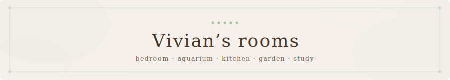

<p align="center">
  
</p>

This website is a collection of interactive spaces designed to feel like a digital home, where you can wander through a bedroom, a kitchen, or a garden as a way to find your way into my recipe archive and project gallery. I built the site because I wanted a corner of the internet that felt entirely separate from the performant, engagement-driven nature of social platforms, focusing instead on creating a sense of place where I could archive the things I care about in a way that feels intentional and personal.

## The Vision

The project began as a quiet necessity—a way to organize my recipes without the noise of the modern web—but quickly transformed into a deeper exploration of digital architecture. I wanted to build a high-fidelity experience that didn't feel like "software," but rather a place with a handmade personality. The aesthetic lands somewhere between a vintage watercolor journal and a Studio Ghibli background painting, emphasizing warmth, shifting light, and the gentle imperfection of a hand-drawn line.

### The Color Language

The palette is anchored in a set of core neutrals and "living" accents defined specifically in the project's design system. It moves away from standard digital blacks and whites, favoring the soft, tactile feel of a watercolor sketch—interspersed with hazy pastel sunbeams and the muted pinks and greens of the aquarium's coral reef.

**The Foundation (Neutrals)**  
    

**The Red Panda (Identity)**  
  

**Living Accents (Atmosphere)**  
    

### Typography and Voice

The fonts reinforce this handmade narrative. *Homemade Apple* flows through the scene labels like margin notes in a lived-in journal, while *DynaPuff* keeps the interactive UI soft and approachable. For the more "archival" moments—recipe headers and the book spines in the study—*Yuji Syuku* and *Antic Didone* provide a quiet editorial weight.

## The Home Library

The site is organized into distinct scenes, each serving a different purpose in this digital sanctuary:

*   **The Cozy Room:** The entrance to the archive, where shifting shadows and an interactive aquarium set a contemplative tone.
*   **The Kitchen:** A culinary workbench. Every jar on the shelf is more than a decoration; they are entry points to recipe categories, from *Stir-fries* to *Drinks*.
*   **The Study:** A quiet repository for technical projects and code, where book spines on the shelf lead to my gallery of works on GitHub.
*   **The Aquarium:** A drift into a world of shared treasures—bits of trivia, quotes, and childhood favorites revealed by the creatures within.
*   **The Garden:** A space for connection. It houses my "about me" information and contact details, and (in progress) a hidden garden gallery that will eventually showcase my creations.

## The Ritual of Writing

The **Recipe Creator** (found tucked away in a ceramic jar in the kitchen) is a custom-built workshop for adding new entries to the library. Building it was a lesson in balance—creating a tool that was powerful enough to generate structured JSON but simple enough to maintain the "non-performant" soul of the site.

To add a new recipe:
1.  Open the **Recipe Creator** jar in the Kitchen.
2.  Sketch out your ingredients and instructions using the intuitive group-based editor.
3.  Copy the generated JSON and place it in the `src/data/recipes/` directory.
4.  The site's archival system will automatically detect and catalog your new entry.

## Building with AI

This project was built in an intensive, creative partnership with AI coding tools. Rather than just generating code, we used AI as a translator for "feeling"—solving precision challenges like placing labels on hand-drawn objects where standard CSS centering failed. We co-created custom utility tools, like coordinate draggers and perspective sliders, specifically to fine-tune the visual polish that makes the room feel alive.

## The Foundation


```bash
npm install
npm run dev
```
